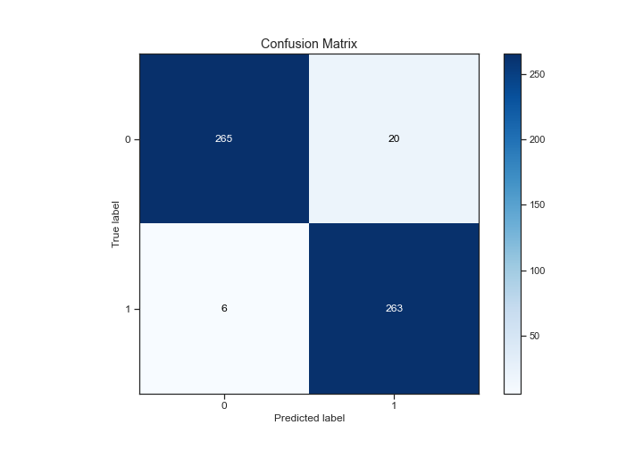
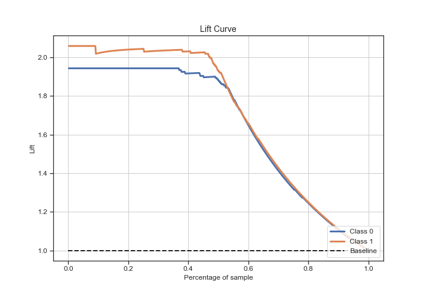

# Summary of 2_DecisionTree

[<< Go back](../README.md)

## Decision Tree
- **n_jobs**: -1
- **criterion**: gini
- **max_depth**: 3
- **explain_level**: 2

## Validation
 - **validation_type**: split
 - **train_ratio**: 0.75
 - **shuffle**: True
 - **stratify**: True

## Optimized metric
logloss

## Training time

7.1 seconds

## Metric details
|           |    score |   threshold |
|:----------|---------:|------------:|
| logloss   | 0.126688 |  nan        |
| auc       | 0.9868   |  nan        |
| f1        | 0.952899 |    0.435046 |
| accuracy  | 0.953069 |    0.435046 |
| precision | 0.929329 |    0.435046 |
| recall    | 1        |    0        |
| mcc       | 0.907354 |    0.435046 |

## Confusion matrix (at threshold=0.435046)
|              |   Predicted as 0 |   Predicted as 1 |
|:-------------|-----------------:|-----------------:|
| Labeled as 0 |              265 |               20 |
| Labeled as 1 |                6 |              263 |

## Learning curves

## Decision Tree 

### Tree #1

### Rules

if (feature_1 <= 0.141) and (feature_2 > 0.073) and (feature_1 <= 0.135) then class: 1 (proba: 99.02%) | based on 715 samples

if (feature_1 > 0.141) and (feature_1 > 0.147) and (feature_5 <= 0.898) then class: 0 (proba: 100.0%) | based on 578 samples

if (feature_1 > 0.141) and (feature_1 > 0.147) and (feature_5 > 0.898) then class: 0 (proba: 94.24%) | based on 191 samples

if (feature_1 <= 0.141) and (feature_2 > 0.073) and (feature_1 > 0.135) then class: 1 (proba: 81.25%) | based on 64 samples

if (feature_1 > 0.141) and (feature_1 <= 0.147) and (feature_2 <= 0.071) then class: 0 (proba: 98.04%) | based on 51 samples

if (feature_1 <= 0.141) and (feature_2 <= 0.073) and (feature_1 <= 0.134) then class: 1 (proba: 65.38%) | based on 26 samples

if (feature_1 > 0.141) and (feature_1 <= 0.147) and (feature_2 > 0.071) then class: 1 (proba: 78.26%) | based on 23 samples

if (feature_1 <= 0.141) and (feature_2 <= 0.073) and (feature_1 > 0.134) then class: 0 (proba: 100.0%) | based on 14 samples

## Permutation-based Importance

## Confusion Matrix

## Normalized Confusion Matrix

## ROC Curve

## Kolmogorov-Smirnov Statistic

## Precision-Recall Curve

## Calibration Curve

## Cumulative Gains Curve

## Lift Curve

## SHAP Importance

## SHAP Dependence plots

### Dependence (Fold 1)

## SHAP Decision plots

### Top-10 Worst decisions for class 0 (Fold 1)

### Top-10 Best decisions for class 0 (Fold 1)

### Top-10 Worst decisions for class 1 (Fold 1)

### Top-10 Best decisions for class 1 (Fold 1)

[<< Go back](../README.md)
