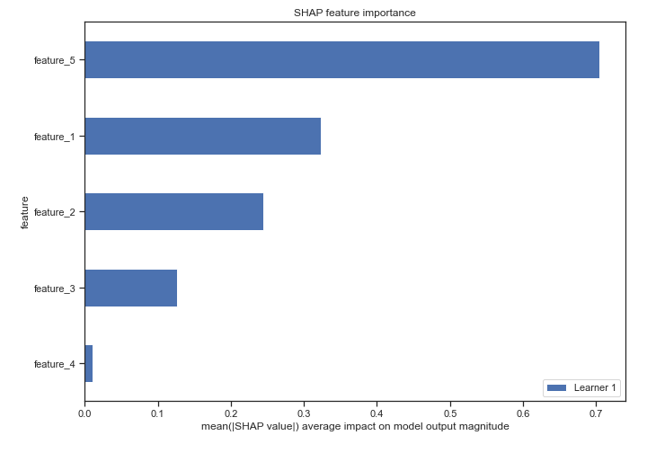

# Summary of 3_Linear

[<< Go back](../README.md)

## Logistic Regression (Linear)
- **n_jobs**: -1
- **explain_level**: 2

## Validation
 - **validation_type**: split
 - **train_ratio**: 0.75
 - **shuffle**: True
 - **stratify**: True

## Optimized metric
logloss

## Training time

5.3 seconds

## Metric details
|           |    score |   threshold |
|:----------|---------:|------------:|
| logloss   | 0.41865  | nan         |
| auc       | 0.884276 | nan         |
| f1        | 0.879865 |   0.472495  |
| accuracy  | 0.871841 |   0.472495  |
| precision | 0.842857 |   0.814602  |
| recall    | 1        |   0.0239082 |
| mcc       | 0.758766 |   0.472495  |

## Confusion matrix (at threshold=0.472495)
|              |   Predicted as 0 |   Predicted as 1 |
|:-------------|-----------------:|-----------------:|
| Labeled as 0 |              223 |               62 |
| Labeled as 1 |                9 |              260 |

## Learning curves

## Coefficients
| feature   |   Learner_1 |
|:----------|------------:|
| feature_2 |    6.58158  |
| intercept |    1.36946  |
| feature_5 |    0.838316 |
| feature_4 |    0.758628 |
| feature_3 |   -3.16416  |
| feature_1 |  -11.5721   |

## Permutation-based Importance

## Confusion Matrix

## Normalized Confusion Matrix

## ROC Curve

## Kolmogorov-Smirnov Statistic

## Precision-Recall Curve

## Calibration Curve

## Cumulative Gains Curve

## Lift Curve

## SHAP Importance

## SHAP Dependence plots

### Dependence (Fold 1)

## SHAP Decision plots

### Top-10 Worst decisions for class 0 (Fold 1)

### Top-10 Best decisions for class 0 (Fold 1)

### Top-10 Worst decisions for class 1 (Fold 1)

### Top-10 Best decisions for class 1 (Fold 1)

[<< Go back](../README.md)
