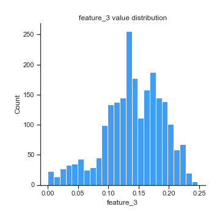

# Exploratory Data Analysis

[<< Go back](../README.md)
## Feature : target
- **Feature type** : discrete
- **Missing** : 0.0%
- **Unique** : 2
- **Count** :2216.0
- **Mean** :0.4855595667870036
- **Std** :0.4999042373925857
- **Min** :0.0
- **25%th Percentile** : 0.0
- **50%th Percentile** : 0.0
- **75%th Percentile** : 1.0
- **Max** :1.0

## Feature : feature_1
- **Feature type** : continous
- **Missing** : 0.0%
- **Unique** : 2216
- **Count** :2216.0
- **Mean** :0.14323944571423874
- **Std** :0.03234094954726957
- **Min** :0.0609657074905648
- **25%th Percentile** : 0.11691669497082775
- **50%th Percentile** : 0.1417974912164065
- **75%th Percentile** : 0.16968799958567274
- **Max** :0.237636387269209

## Feature : feature_2
- **Feature type** : continous
- **Missing** : 0.0%
- **Unique** : 2162
- **Count** :2216.0
- **Mean** :0.08328938697355603
- **Std** :0.04309724915920657
- **Min** :0.0145577312626604
- **25%th Percentile** : 0.04195734926202135
- **50%th Percentile** : 0.09224166533900645
- **75%th Percentile** : 0.113501843120692
- **Max** :0.252225201072386

## Feature : feature_3
- **Feature type** : continous
- **Missing** : 0.0%
- **Unique** : 2182
- **Count** :2216.0
- **Mean** :0.14114639494185985
- **Std** :0.0488477935179732
- **Min** :0.0002287581699346
- **25%th Percentile** : 0.1115816411644755
- **50%th Percentile** : 0.1411864713537555
- **75%th Percentile** : 0.1771397587407325
- **Max** :0.24734693877551

## Feature : feature_4
- **Feature type** : continous
- **Missing** : 0.0%
- **Unique** : 2216
- **Count** :2216.0
- **Mean** :0.05671339678048811
- **Std** :0.01685863054659194
- **Min** :0.018363242444455
- **25%th Percentile** : 0.04101116376528352
- **50%th Percentile** : 0.0589436224787833
- **75%th Percentile** : 0.06650631410333198
- **Max** :0.115273246743733

## Feature : feature_5
- **Feature type** : continous
- **Missing** : 0.0%
- **Unique** : 2216
- **Count** :2216.0
- **Mean** :0.8938223727985086
- **Std** :0.04535038041148799
- **Min** :0.738650686223529
- **25%th Percentile** : 0.861022312496811
- **50%th Percentile** : 0.8998453833415765
- **75%th Percentile** : 0.927475838003835
- **Max** :0.98199658896419

[<< Go back](../README.md)
